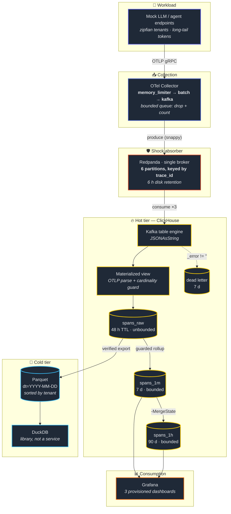
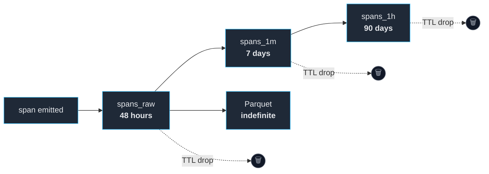

<div align="center">

# LLM & Agent Telemetry Analytics Engine

**A streaming observability pipeline for LLM and agent workloads — built so it can never become the outage it exists to detect.**

Token throughput · KV-cache pressure · TTFT / inter-token latency · distributed agent traces
Ingested, bounded, aggregated and aged out in real time.

[](https://github.com/Aryan-Pillai7/llm-telemetry-engine/actions/workflows/ci.yml)
[](https://www.python.org/)

[](https://opentelemetry.io/)
[](https://redpanda.com/)
[](https://clickhouse.com/)
[](https://duckdb.org/)
[](https://grafana.com/)

[Quick start](#-quick-start) · [Architecture](#-architecture) · [Benchmarks](#-measured-performance) · [Docs](#-documentation) · [Engineering notes](#-engineering-notes-the-throughline)

</div>

---

## Overview

Observability infrastructure sits next to the thing it observes. If it ever applies
pressure back toward that thing — by blocking, by eating its CPU, by holding its request
thread — it has stopped being observability and started being an incident.

This pipeline ingests **high-cardinality, multi-tenant** LLM trace data at scale under
that constraint. Three properties define it:

| | |
|---|---|
| **Non-blocking by construction** | Bounded export queues drop-and-count instead of pushing back. A ClickHouse stall becomes *consumer lag*, never endpoint latency. Measured: 135k messages of lag while endpoint p99 moved 28.4 → 32.6 ms. |
| **Cardinality is a budget, not a hope** | Rollup dimensions are declared in a registry with per-dimension budgets, enforced by a ClickHouse dictionary consulted on every row. Unregistered values collapse into an explicit, alertable bucket. |
| **Hot/cold lifecycle** | Raw spans live 48 h; rollups 7 / 90 days; Parquet indefinitely. The cold tier costs disk, not standing RAM — DuckDB is a library, not a service. |

> [!IMPORTANT]
> The most transferable part of this project isn't a throughput number. It's that
> **several of its own verification mechanisms initially looked correct while checking the
> wrong thing — or while not running at all.** Five times, at five different layers.
> See [Engineering notes](#-engineering-notes-the-throughline).

---

## Architecture

Deliberately lean: **no Kafka cluster, no ZooKeeper, no Iceberg catalog, no consumer
microservice.** Four containers, ~540 MiB idle.

> [!TIP]
> Diagram nodes are clickable in Mermaid-native viewers. GitHub renders the
> diagram in a sandboxed frame that strips the links, so the same mapping is
> repeated as a table underneath — it works everywhere.



<details>
<summary><b>Where each box lives in the repo</b></summary>

| Node | Source | What it does |
| --- | --- | --- |
| Mock endpoints | [`src/telemetry_engine/emitters/workload.py`](src/telemetry_engine/emitters/workload.py) | Workload generator |
| OTel Collector | [`deploy/otelcol/config.yaml`](deploy/otelcol/config.yaml) | Collector config |
| Redpanda | [`deploy/redpanda/topics.yaml`](deploy/redpanda/topics.yaml) | Topic spec |
| Kafka table engine | [`schemas/clickhouse/010_kafka_spans.sql`](schemas/clickhouse/010_kafka_spans.sql) | Kafka engine table |
| Materialized view | [`schemas/clickhouse/110_mv_spans_1m_v2.sql`](schemas/clickhouse/110_mv_spans_1m_v2.sql) | Guarded rollup view |
| `spans_raw` | [`schemas/clickhouse/020_spans_raw.sql`](schemas/clickhouse/020_spans_raw.sql) | Raw span table |
| `spans_1m` | [`schemas/clickhouse/070_spans_1m.sql`](schemas/clickhouse/070_spans_1m.sql) | 1-minute rollup |
| `spans_1h` | [`schemas/clickhouse/090_spans_1h.sql`](schemas/clickhouse/090_spans_1h.sql) | 1-hour rollup |
| Dead letter | [`schemas/clickhouse/040_spans_ingest_errors.sql`](schemas/clickhouse/040_spans_ingest_errors.sql) | Dead letter table |
| Parquet lake | [`src/telemetry_engine/coldtier/export.py`](src/telemetry_engine/coldtier/export.py) | Verified exporter |
| DuckDB | [`src/telemetry_engine/coldtier/query.py`](src/telemetry_engine/coldtier/query.py) | DuckDB query layer |
| Grafana | [`src/telemetry_engine/dashboards.py`](src/telemetry_engine/dashboards.py) | Dashboards as code |

```mermaid
sequenceDiagram
    autonumber
    participant E as Endpoint
    participant C as Collector
    participant R as Redpanda
    participant K as ClickHouse

    Note over E,K: Steady state — lag 0
    E->>C: spans (async, off request path)
    C->>R: batched produce
    R->>K: consume, commit offsets

    rect rgb(60, 30, 30)
    Note over K: 💥 Consumer stalls (docker pause)
    E->>C: spans continue
    C->>R: produce continues
    R--xK: no consumption
    Note over R: lag climbs ≈2,000 msg/s → peak 135,447
    Note over E: p99 28.4 ms → 32.6 ms (+15%)<br/>endpoint never blocked
    end

    rect rgb(30, 50, 30)
    Note over K: ✅ Consumer resumes
    R->>K: drains backlog faster than it accrued
    Note over R,K: lag → 0 in 34.2 s
    end
```

</details>


<details>
<summary><b>How backpressure actually behaves under a consumer stall</b> (measured, not asserted)</summary>

<br/>



**Why it recovers:** ClickHouse consumes faster than the generator produces, so a stall of
bounded length is always recoverable. Redpanda's 6-hour retention sets the outage budget —
at ~2,000 msg/s of lag accrual, that's many hours before lag becomes loss.

Full method, and the **four INVALID runs that preceded the valid one** →
[docs/backpressure.md](docs/backpressure.md)

</details>

<details>
<summary><b>Data lifecycle & retention</b></summary>

<br/>



| Tier | Retention | Cardinality | Purpose |
|---|---|---|---|
| `spans_raw` | 48 h | Unbounded | Trace debugging, cold-tier source |
| `spans_1m` | 7 d | Bounded by budget | Dashboards, recent analysis |
| `spans_1h` | 90 d | Bounded by budget | Trend analysis |
| Parquet | Indefinite | Unbounded | History past the TTL |

The exporter is the **only job whose failure is permanent** — a window it skips is deleted
by the TTL and stops existing. Its watermark advances only after a written file is read
back and verified against the source on both row count *and* values.

</details>

---

## Quick start

**Requirements:** Docker Engine with Compose v2 · Python 3.11+

```bash
git clone https://github.com/Aryan-Pillai7/llm-telemetry-engine.git
cd llm-telemetry-engine

python tasks.py install    # create .venv, install package + dev deps
python tasks.py demo       # → populated, queryable pipeline in ~2 minutes
```

<details>
<summary><b>What the demo prints</b></summary>

<br/>

```
[1/6] Starting the stack (Redpanda, ClickHouse, OTel Collector, Grafana)
[2/6] Generating 60s of telemetry at ~3,000 spans/s
[3/6] Waiting 25s for ingest to settle
[4/6] Refreshing the cardinality allowlist from observed traffic
[5/6] Exporting the cold tier to Parquet
[6/6] Reading back what actually landed

========================================================================
  RESULT
========================================================================
  hot tier (spans_raw)        200,322 spans
    tenants / traces               50 / 66,814
    TTFT p95                    266.6 ms
  rollup (spans_1m)           200,322 spans in 1,820 rows
    reduction                     110x fewer rows to scan
  cold tier (Parquet)         200,322 rows in 1 file(s), 11.3 MiB
  consumer lag                      0 messages
  dead-lettered messages            0
```

It reports what it **observed**, not that it succeeded. A demo that prints "done" without
a row count is the same category of thing this project spent eight phases removing.

</details>

Then open **[http://localhost:3000](http://localhost:3000)** (no login) for three
provisioned dashboards.

| Service | Endpoint |
|---|---|
| Grafana | `localhost:3000` |
| ClickHouse | `localhost:8123` (HTTP) · `:9000` (native) |
| Redpanda | `localhost:19092` (Kafka API) |
| OTel Collector | `:4317` / `:4318` (OTLP) · `:8888` (self-telemetry) |

**Drive it yourself:**

```bash
python tasks.py up                                   # stack + topics + schema
telemetry-engine load --duration 30 --rate 5000      # emit telemetry
telemetry-engine cold export                         # age out to Parquet
telemetry-engine backpressure                        # run the graded experiment
```

---

## 📊 Measured performance

> [!NOTE]
> **Sustained delivered throughput is ~12.4k spans/s at 100% delivery.**
> An earlier phase reported 19.7k spans/s — true about spans *created* by the generator,
> never verified as spans *delivered* to the pipeline. At that rate the SDK's own export
> queue discarded a large share before the collector saw them.
> **Quote 12.4k/s.** The larger number measures the generator, not this pipeline.

| Metric | Value |
|---|---|
| Sustained delivered throughput | **~12.4k spans/s** @ 100% delivery |
| Ingest latency (span end → queryable) | p50 **3.2 s** · p95 **8.5 s** |
| Peak lag under a 68 s consumer stall | **135,447** messages |
| Recovery once the consumer resumed | **34.2 s** |
| Endpoint p99 during that stall | 28.4 ms → **32.6 ms** (+15%) |
| Rollup fidelity | totals match raw **exactly**; tDigest p95 within **0.44%** |
| Rollup reduction | **95–110×** fewer rows to scan |
| Tenant-scoped query (1.7 M rows, hot) | **81 ms** |
| Tenant-scoped query (5.7 M rows, cold) | **55 ms** |
| Cold-tier storage | **50.5 bytes/row** |
| At-least-once duplication in the lake | **4.9%** — both views published |

<details>
<summary><b>Why the lake is at-least-once, and why that's published rather than hidden</b></summary>

<br/>

ClickHouse's Kafka engine redelivers on consumer interruption. Measured after the
backpressure experiment's pause/resume: 281,437 duplicate spans — same `span_id`, same
event time, different `ingested_at`.

Two views are published rather than silently picking one:

| View | Contains | Use for |
|---|---|---|
| `spans` | every row as ingested | pipeline questions — *"what did we actually store?"* |
| `spans_deduped` | one row per `span_id` | analytics — *"how many requests did this tenant make?"* |

Deduplicating by default would hide a real property of the system. Not offering the
deduplicated view would make every analytical total quietly wrong.

</details>

---

## Key design decisions

<details>
<summary><b>Cardinality: a registry, a dictionary, and two sentinels</b></summary>

<br/>

A rollup's row count is the product of its dimensions' cardinalities. One unbounded
dimension turns a compact aggregate into something larger than the raw data it summarises.

`schemas/clickhouse/dimensions.yaml` is the contract — every rollup dimension with an
explicit budget. It's synced into a ClickHouse dictionary that the rollup view consults
**per row**, because there's no application process on the ingest path and a guard that
can be bypassed is not a guard.

| Result | When | Meaning |
|---|---|---|
| the value | registered | normal |
| `__other__` | present, **unregistered** | 🚨 actionable — shadow deploy, new region, stale allowlist |
| `__none__` | absent from this span | routine — a tool span has no model |

**Those two sentinels started as one.** On live data that single bucket held 18,243 tool
spans with no model next to exactly 300 genuinely unregistered ones — the actionable
signal was 2% of its own bucket. Splitting them is what makes `__other__` worth alerting
on.

Verified against a planted 25-span shadow deploy at **0.02% of traffic**: the panel goes
red and names the model.

Tenants can't be enumerated ahead of time, so their allowlist is the **top-K by recent
volume** (budget 200). With zipfian traffic the top 200 cover essentially everything.

</details>

<details>
<summary><b>Why ClickHouse consumes Kafka directly (and the sharp edge that creates)</b></summary>

<br/>

The conventional shape is Kafka → consumer service → OLAP store. That's one more
container, one more deploy unit, one more thing to be down at 3 a.m. ClickHouse's Kafka
table engine reads Redpanda directly instead.

The cost has a sharp edge worth knowing: **if the parsing view raises, Kafka consumption
stalls for the entire consumer group.** Every extraction in the materialized view is
therefore *total* — `toUInt32OrZero`, map lookups yielding empty strings — so a malformed
span produces a row with empty fields rather than halting ingestion for everyone.

A unit test greps for any bare `toUInt`/`toFloat` that sneaks in. Messages that still
fail route to a dead-letter table rather than stalling a partition.

</details>

<details>
<summary><b>Why the cold tier partitions by date only</b></summary>

<br/>

Partitioning by tenant is the obvious choice and the wrong one: with a zipfian tail of
mostly-idle tenants it multiplies file count by tenant cardinality and produces thousands
of tiny files.

Instead: `dt=` is the only partition key, and rows are **sorted by `(tenant_id, ts)`**
inside each file. That gives DuckDB per-row-group min/max statistics, so a tenant filter
skips row groups without opening them — the same pruning, without the file explosion.

**The sort is load-bearing.** An unsorted lake returns correct answers while reading every
byte of every query, and nothing surfaces except a slow dashboard nobody attributes to the
layout. `telemetry-engine cold verify` checks it explicitly.

</details>

---

## Engineering notes: the throughline

The pipeline works and the numbers above are real. But the throughline of the build was
something else:

> **Several of this system's verification mechanisms initially looked correct while
> checking the wrong thing — or while not running at all.**

Not one bug of that shape. A recurring one, found five separate times:

| Layer | The mechanism | What it was actually doing |
|---|---|---|
| Aggregation | `__other__` cardinality bucket | Bounded and *meaningless* — 18,243 routine spans hid exactly 300 unregistered ones |
| Ingest | Pipeline-latency query | Ran, returned numbers, measured **backlog replay** instead of steady state — p95 24 s vs a true 8.5 s |
| Dashboards | Panel SQL validation | Every query valid against ClickHouse; **every panel failing** through Grafana — time variables interpolate frontend-only |
| Experiment | Backpressure harness | **Four consecutive runs reported INVALID.** Three of four bugs were in the *measuring apparatus*, not the pipeline |
| Cold tier | Export value-fingerprint check | Written, documented, and **never called** — the exporter verified row counts only, exactly the gap it existed to close |

That last one is a **distinct failure mode**, and the most interesting. A check examining
the wrong layer at least *runs* — its output can be compared against reality. An inert
check emits nothing: nothing contradicts it, no test fails, and **no amount of runtime
testing can find it.** Only reading the code can.

So that reading is automated. The response each time was to make the wrong version
*unavailable* rather than documented:

```bash
python tasks.py audit-guards   # finds guards never called from the path they protect
python tasks.py typecheck      # mypy — configured in phase 0, run by nothing for 8 phases
```

- **Inert-guard audit** — parses the source for guard-shaped functions never invoked, and
  runs in CI. First run found a real one: `Registry.validate_columns`, which promised in
  its own docstring to fail *"at apply time"* and was called from nowhere.
- **A configured tool nobody runs** is indistinguishable from no tool, except it looks
  like coverage. mypy's first execution: 13 errors, including `None - timedelta` in
  `rollup-backfill`.
- **CI is code and must itself be run.** Simulating the integration job locally before
  pushing found two ordering bugs *in the workflow*.

Elsewhere the same principle, enforced structurally:

| Guard | Behaviour |
|---|---|
| `ingest/latency.py` | **Raises** if a latency window filters on ingest time instead of event time |
| `read_collector()` | Returns `None`, never a zeroed snapshot — fabricated data survives review, a gap doesn't |
| Lag reader | Cannot join the consumer group it measures |
| `backpressure` | Prints **RUN INVALID** and exits non-zero if any pre-registered check fails |

---

## Project structure

```
llm-telemetry-engine/
├── deploy/                     # Compose, otelcol, ClickHouse, Grafana provisioning
├── schemas/clickhouse/         # Versioned DDL + dimensions.yaml (cardinality contract)
├── src/telemetry_engine/
│   ├── cardinality/            # Dimension registry + enforcement guard
│   ├── coldtier/               # Parquet layout, verified export, DuckDB queries
│   ├── emitters/               # Mock endpoints, workload generation, OTLP export
│   ├── experiments/            # The graded backpressure experiment
│   ├── ingest/                 # Topics, consumer-lag SLI, latency measurement
│   ├── storage/                # ClickHouse client, migrations, rollup backfill
│   └── dashboards.py           # Grafana dashboards as code
├── scripts/                    # Demo, calibration, verifiers, guard audit
├── tests/{unit,integration}/   # 150 + 40 tests
└── docs/                       # Architecture, backpressure, cold tier, runbook
```

---

## Development

```bash
python tasks.py            # list every target
python tasks.py ci         # lint + mypy + guard audit + unit tests
python tasks.py up         # stack + topics + schema + allowlist
python tasks.py test-integration
```

<details>
<summary><b>Task runner &amp; CLI reference</b></summary>

<br/>

There's no Makefile — the primary dev environment is Windows, and one cross-platform
`tasks.py` beats a Makefile plus a PowerShell shim that drift apart.

| Target | Does |
|---|---|
| `install` · `demo` | Set up · one-command populated pipeline |
| `lint` `fmt` `typecheck` `audit-guards` | Static checks |
| `test` · `test-integration` · `coverage` | Test suites |
| `ci` | Everything the static CI jobs run |
| `up` `down` `nuke` `logs` `ps` | Stack lifecycle |
| `load` · `load-burst` · `serve` | Generate telemetry |

```bash
telemetry-engine config             # effective, env-resolved settings
telemetry-engine bootstrap          # topics + schema + allowlist
telemetry-engine load               # synthetic load at a target span rate
telemetry-engine monitor            # sample lag and drop counters
telemetry-engine dimensions status  # observed cardinality vs budget
telemetry-engine rollup-status      # do the rollups cover all of raw?
telemetry-engine cold status        # lake coverage vs the hot-tier TTL
telemetry-engine backpressure       # the measured experiment, graded
telemetry-engine dashboards         # regenerate Grafana JSON
```

</details>

<details>
<summary><b>CI pipeline</b></summary>

<br/>

| Job | Runs |
|---|---|
| **static** | ruff · mypy · inert-guard audit |
| **unit** | 150 tests with coverage, uploaded as an artifact |
| **config** | compose validation · otelcol config against the real binary · dashboard drift check |
| **integration** | Full stack up → generate telemetry → export cold tier → 40 integration tests → both dashboard verifiers → teardown |

Two dashboard verifiers, and both are needed: `verify_dashboards.py` proves the SQL runs
against ClickHouse, `verify_grafana.py` proves the *panel* works through Grafana. The
dashboards once passed the first and failed the second for every panel.

</details>

---

## Documentation

| Document | Covers |
|---|---|
| [docs/architecture.md](docs/architecture.md) | Design, data model, why each tier exists |
| [docs/backpressure.md](docs/backpressure.md) | The measured experiment + the four INVALID runs |
| [docs/coldtier.md](docs/coldtier.md) | Parquet layout, at-least-once, export verification |
| [docs/runbook.md](docs/runbook.md) | Symptom → diagnosis → fix, incl. *"before trusting any measurement"* |


